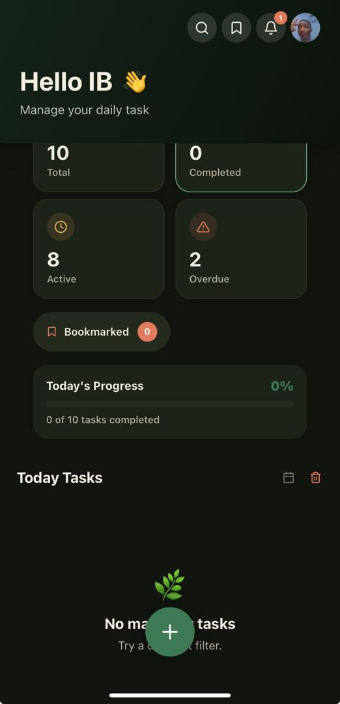
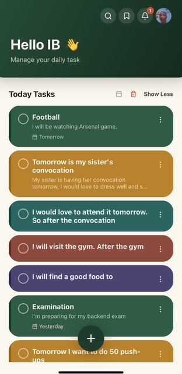
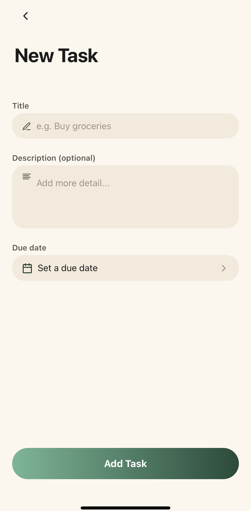
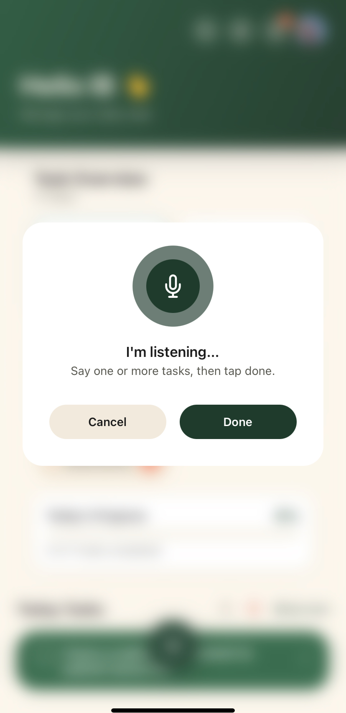
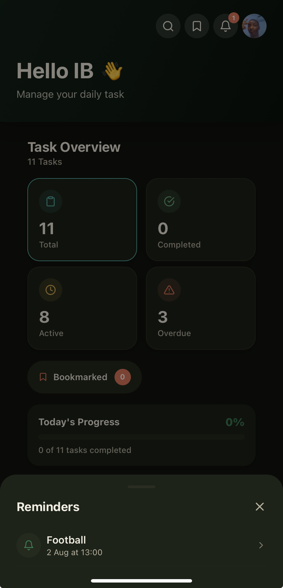
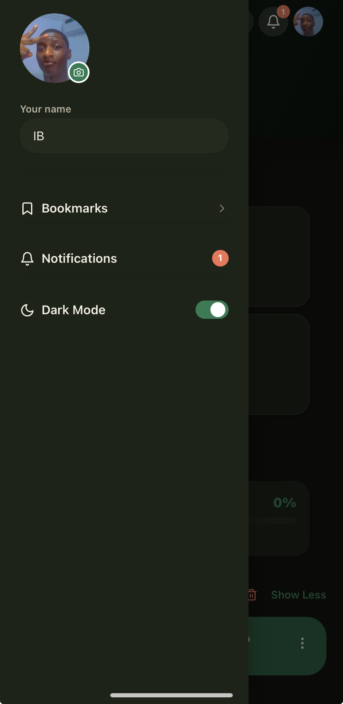
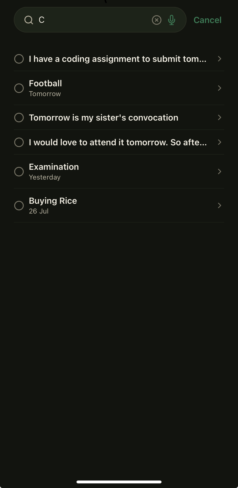
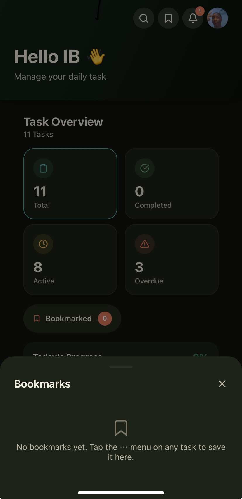
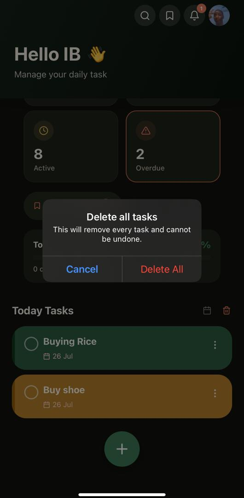

# Todo-App
A premium-feeling task management app built with React Native (Expo), featuring voice-to-task input, smart search, task reminders, bookmarks, and full local persistence — no backend required.

## Screenshots

| Empty State | Task List | Add Task |
|---|---|---|
|  |  |  |

| Voice Input | Notifications | Dark Mode |
|---|---|---|
|  |  |  |

| Search | Notifications | Bookmarks |Edit Task| Delete All Task
|---|---|---|
|  |  |  |  |

## Features

### Core
-  Add tasks with title + optional description
-  Mark tasks complete/incomplete
-  Edit Tasks
-  Delete individual tasks, multiple selected tasks, or all tasks at once
-  Full task list with visual distinction between completed/pending
-  AsyncStorage persistence — tasks survive app restarts
-  React Navigation between Task List and Add Task screens
-  Edge case handling: empty title validation, empty list state

### Voice Input (FAB)
-  Floating action button expands into "Type it" / "Speak it" options
- Speech is transcribed via the AssemblyAI API
- Natural language multi-task splitting — e.g. *"buy groceries and call mom"* becomes two separate tasks automatically

### Bonus Features
-  Due dates with optional reminder time, plus sort-by-due-date
-  Full-screen search overlay with text and voice search
-  Light/dark theme toggle (persisted)
-  Local push notifications for task reminders, tap-to-open the exact task
-  Bookmarks — save tasks for quick access via a dedicated panel
-  Local profile (name + photo), no login/signup required
-  Task Overview dashboard — Total / Completed / Active / Overdue / Bookmarked stat cards, each tappable as a filter, plus an animated completion progress bar
-  Long-press multi-select mode for bulk actions
-  Unit tests for core utilities (date formatting, transcript parsing)
-  Smooth animations throughout via React Native Reanimated
-  Full TypeScript

## Tech Stack

- **Expo SDK 54** / React Native 0.81 / React 19
- **TypeScript**
- **React Navigation 7** (native stack)
- **AsyncStorage** for local persistence
- **React Native Reanimated 4** for animations
- **expo-audio** for voice recording
- **expo-notifications** for local task reminders
- **expo-image-picker** for profile photos
- **AssemblyAI API** for speech-to-text transcription
- **Jest** for unit tests

## Getting Started

### Prerequisites
- Node.js and npm
- Expo Go app on your phone ([iOS](https://apps.apple.com/app/expo-go/id982107779) / [Android](https://play.google.com/store/apps/details?id=host.exp.exponent))

### Setup

1. Clone the repo:
```bash
   git clone https://github.com/iblawal/Todo-App.git
   cd Todo-App
```

2. Install dependencies:
```bash
   npm install
```

3. Set up your environment variables:
```bash
   cp .env.example .env
```
   Open `.env` and add your AssemblyAI API key:

   Get a free key (no credit card required) at [assemblyai.com](https://www.assemblyai.com) — the free tier includes $50 in credits.

4. Start the development server:
```bash
   npx expo start
```
   Scan the QR code with Expo Go.

### Running Tests
```bash
npx jest
```

## How Voice Input Works

1. Tap the "+" FAB on the Task List screen → choose "Speak it"
2. Speak one or more tasks naturally
3. Tap "Done" — audio is uploaded to AssemblyAI for transcription
4. The transcript is parsed and split into separate tasks (splitting on "and", "then", commas)
5. Tasks are added to your list automatically

Voice input is also available inside the search overlay, for hands-free searching.

## How Reminders Work

When adding a due date to a task, you can also pick a reminder time. A local notification is scheduled for that exact date/time. Tapping the notification opens the app directly on that task. No backend or push service is involved — everything is scheduled on-device.

## Project Structure
src/
├── components/
│ ├── common/ # SearchOverlay, ProfileDrawer, NotificationsPanel, BookmarksPanel, StatBadges, etc.
│ ├── task/ # TaskCard, TaskActionSheet
│ ├── voice/ # VoiceInputModal, FAB
│ └── ui/ # Screen, Header, Input, Button, Card
├── context/ # TaskContext, ProfileContext (AsyncStorage-backed state)
├── navigation/ # React Navigation stack
├── screens/ # TaskListScreen, AddTaskScreen
├── services/ # voiceTranscription, taskParser, notifications
├── storage/ # AsyncStorage helpers
├── theme/ # Colors, spacing, light/dark ThemeContext
├── types/ # Shared TypeScript types
├── utils/ # Date formatting, ID generation
└── tests/ # Jest unit tests

## Known Limitations

- Voice transcription and search-by-voice require an internet connection
- Notification reminders require Expo Go/device permission to be granted

---

Built as part of a technical assessment.
